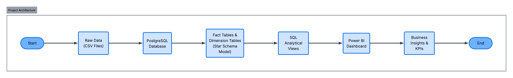
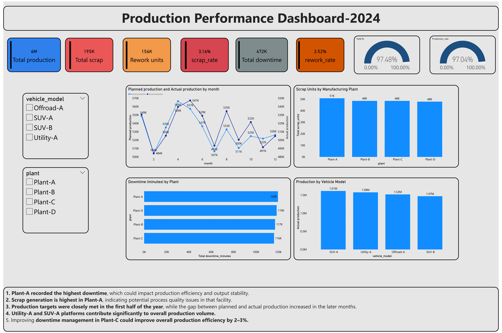
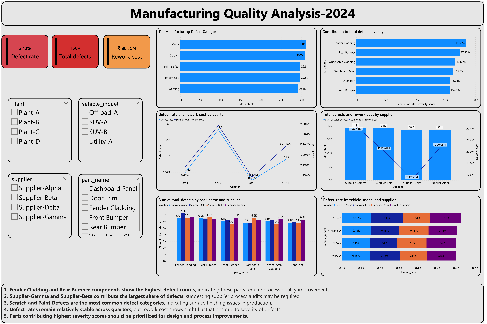
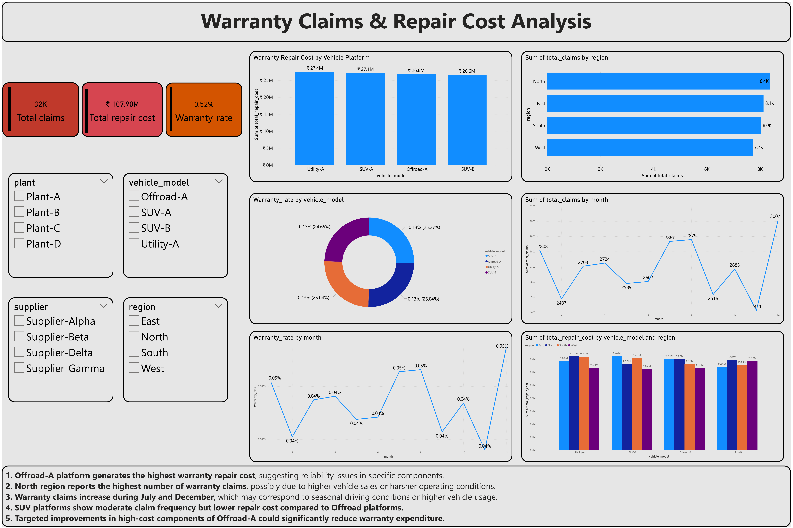

**Automotive Manufacturing Analytics Dashboard**

**Project Overview**

This project analyzes automotive manufacturing operations using production, quality, and warranty data to identify inefficiencies, defect patterns, and cost drivers.

The objective of this analysis is to provide insights into:

1. Production performance

2. Manufacturing quality issues

3. Supplier defect contribution

4. Warranty claims and repair costs

The analysis is implemented using SQL-based data modeling and interactive dashboards in Microsoft Power BI.

**Business Problem**

Automotive manufacturers must continuously monitor operational performance across production plants and suppliers to maintain efficiency, reduce defects, and minimize warranty costs.

Key challenges addressed in this project include:

1. Identifying plants with high downtime or scrap generation

2. Detecting parts and suppliers contributing to defects

3. Understanding defect severity and rework costs

4. Analyzing warranty claim trends and repair costs across regions

5. Monitoring vehicle models with higher failure rates

The dashboard enables data-driven decision making for manufacturing quality and reliability improvement.

**Project Architecture**

The project follows a data analytics pipeline from raw manufacturing data to interactive dashboards.

Steps involved:

1. Raw datasets containing production, quality, and warranty data are loaded into PostgreSQL.
2. Dimension tables are created to normalize descriptive attributes.
3. Fact tables are designed to store measurable metrics.
4. SQL analytical views are created for reporting calculations.
5. The views are imported into Power BI.
6. Interactive dashboards provide insights into production performance, manufacturing quality, and warranty claims.

**Dataset Description**

The project uses simulated automotive manufacturing data consisting of three operational domains.

**Production Data**

Contains manufacturing output information.

Columns include:

1. production_date

2. vehicle_model

3. plant

4. planned_production

5. actual_production

6. scrap_units

7. rework_units

8. downtime_minutes

**Quality Inspection Data**

Contains defect and inspection results.

Columns include:

1. inspection_date

2. vehicle_model

3. plant

4. supplier

5. part_name

6. defect_type

7. inspection_method

8. failure_mode

9. defect_count

10. severity_score

**Warranty Claims Data**

Contains field failure and repair information.

Columns include:

1. claim_date

2. vehicle_model

3. plant

4. supplier

5. part_name

6. failure_mode

7. claim_count

8. repair_cost

9. vehicle_age_months

10. region

**Data Model**

A star schema data warehouse model was implemented to support analytical queries and dashboard reporting.

**Fact Tables**

production_fact
quality_fact
warranty_fact

These tables store quantitative metrics used for analysis.

**Dimension Tables**

date_dimension
vehicle_dimension
plant_dimension
dim_part
dim_defect
dim_inspection
dim_region

Dimension tables provide descriptive attributes used for filtering and grouping.

**Star Schema Architecture**

Fact tables are connected to multiple dimension tables to enable efficient analytical queries.

Example relationships:

production_fact
- vehicle_dimension
- plant_dimension
- date_dimension

quality_fact
- dim_part
- dim_defect
- dim_inspection
- plant_dimension

warranty_fact
- dim_region
- dim_part
- dim_defect

This structure enables flexible slicing of data across vehicle models, suppliers, plants, and regions.

**Data Processing Workflow**

Data preparation and transformation were performed using SQL.

Steps include:

1. Raw datasets loaded into PostgreSQL tables

2. Dimension tables created to normalize descriptive attributes

3. Fact tables populated with aggregated metrics

4. SQL views created for analytical queries

5. Views imported into Power BI for dashboard development

**Analytical Views**

To simplify reporting, analytical views were created.

**Quality Analysis View**

Combines defect metrics with production context.

Includes:

1. total_defects

2. defect_rate

3. severity_score

4. rework_cost

5. supplier

6. part_name

7. vehicle_model

8. plant

**Warranty Analysis View**

Aggregates warranty claims and repair cost data.

Includes:

1. total_claims

2. warranty_rate

3. total_repair_cost

4. vehicle_age_months

5. region

6. vehicle_model

**Production Summary View**

Provides aggregated production metrics.

Includes:

1. planned_production

2. actual_production

3. scrap_units

4. rework_units

5. downtime_minutes

6. production_rate

**Dashboard Features**

Interactive dashboards were developed in Power BI to analyze operational performance.

Production Performance Dashboard

**Key metrics:**

• Total Production

• Scrap Units

• Rework Units

• Downtime

• Production Rate

Visualizations include:

• Planned vs Actual Production Trend

• Scrap Units by Plant

• Downtime by Plant

• Production by Vehicle Model

**Manufacturing Quality Analysis**

Key metrics:

• Total Defects

• Defect Rate

• Rework Cost

• Severity Score

Visualizations include:

• Top Defect Categories

• Defects by Part and Supplier

• Quarterly Defect Trends

• Severity Contribution by Component

**Warranty Analysis Dashboard**

Key metrics:

• Total Claims

• Warranty Rate

• Total Repair Cost

Visualizations include:

• Claims by Region

• Repair Cost by Vehicle Model

• Monthly Warranty Trend

• Warranty Cost Distribution

**Key Insights**

Production Analysis

• Plant-C recorded the highest downtime, indicating potential production efficiency issues.

• Scrap generation is highest in Plant-A, suggesting process quality improvements are needed.

Quality Analysis

• Fender Cladding and Rear Bumper components show the highest defect counts.

• Supplier-Gamma and Supplier-Beta contribute significantly to defect occurrences.

Warranty Analysis

• Offroad-A vehicle platform generates the highest repair cost.

• Northern region shows the highest number of warranty claims.

These insights can help manufacturers prioritize process improvements and supplier quality management.

**Tools and Technologies**

Database
PostgreSQL

Query Language
SQL

Data Modeling
Star Schema Data Warehouse Design

Visualization
Power BI

Data Analysis
DAX Measures and SQL Aggregations

**Repository Structure**

automotive-manufacturing-analytics

datasets
raw_data_files

sql
schema.sql
dimension_tables.sql
fact_tables.sql
analytics_views.sql

powerbi
automotive_dashboard.pbix

report
Automotive_Analytics_Project.pdf

README.md

**Skills Demonstrated**

SQL Data Modeling
Star Schema Design
Fact and Dimension Tables
Data Cleaning and Transformation
Analytical SQL Queries
Power BI Dashboard Development
KPI Development
Manufacturing Analytics

**Future Improvements**

Potential extensions for this project include:

• Predictive maintenance analysis

• Warranty failure prediction using machine learning

• Supplier defect risk scoring

• Real-time production monitoring

